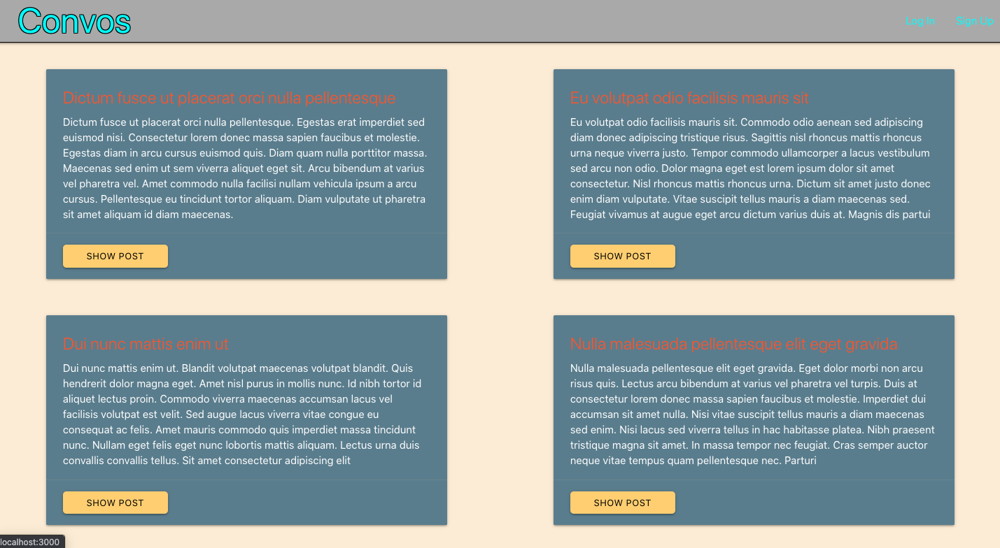
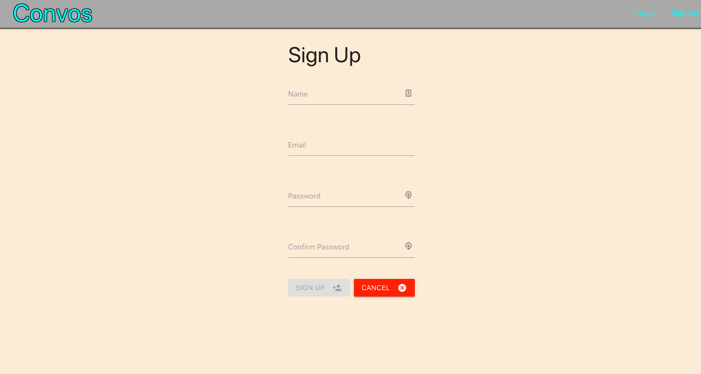
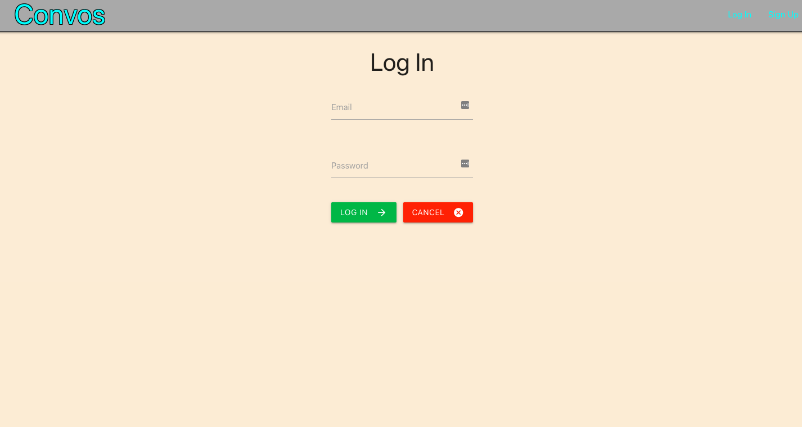
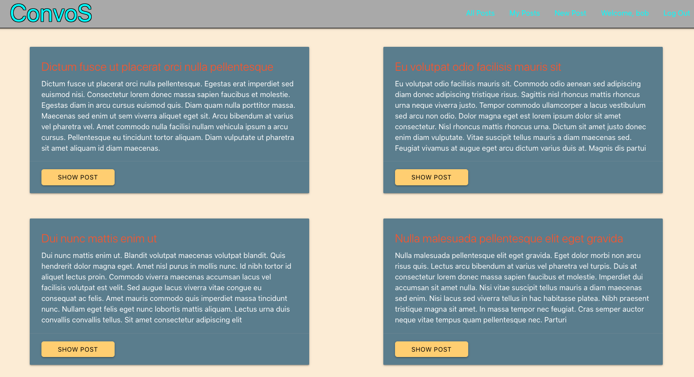
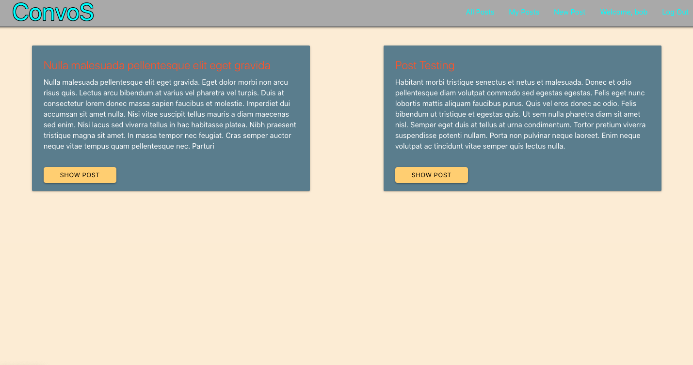
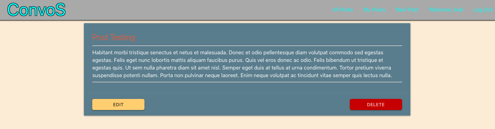
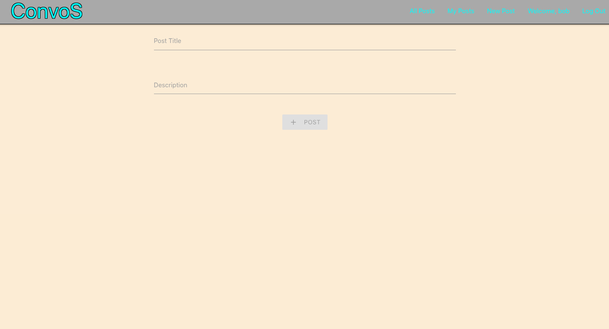
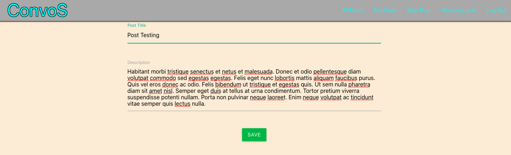
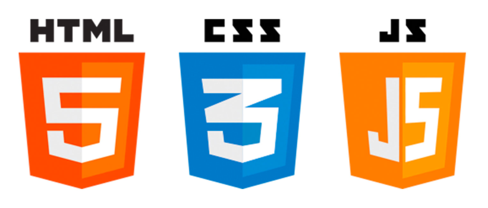
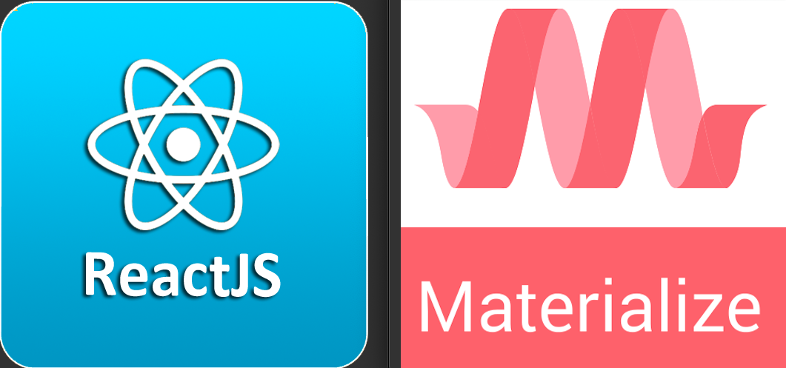

## Welcome to [ConvoS](https://ga-convos.herokuapp.com/) my Unit 2 project.

[Trello Board](https://trello.com/b/gCHXk5jW/ga-convos)
[LinkedIn](https://www.linkedin.com/in/matthewmoquin/)

### Description:
ConvoS is a minimalist blog/messaging app

### Application Navigation:
#### < Landing Page \>

#### < Signup Page\>

#### < Login Page \>

#### < Home Page \>

#### < User Posts Page \>

#### < Show Post Page \>

#### < Add Post Page \>

#### < Edit Post Page />

### Technologies Used:

### Navigation Instructions:

( Launch the app [here](https://ga-convos.herokuapp.com/) )

When you first open the app you will need to either login or signup. Once logged in, you will be able to see all the posts from all users.
You can add your own posts by clicking on the "New Post" link in the navigation bar. I you would like to see only your own posts, simply select "My Posts" from the navigation bar. By clicking on the "Show Post" button on any post, it will bring you to the full post. If you want to edit a post of yours, you may do so by selecting edit from inside the show post page. Likewise if you should desire to remove your post from the app.

### Future Features:

* Comment on posts
* Reply to comments
* Real-time chat
* Add pictures and URLs to posts

### Credits:
* 
